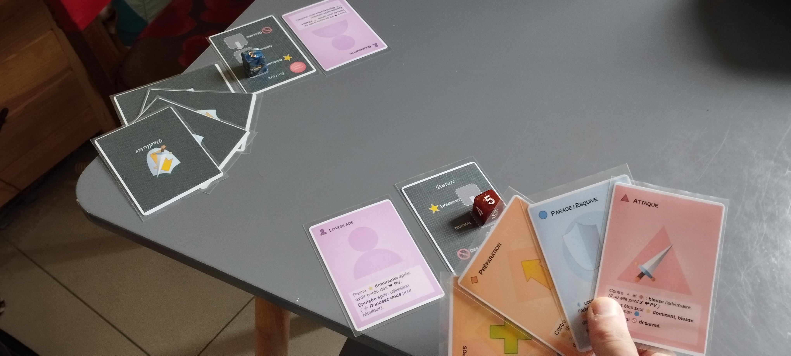

# Présentation

- Durée: 15 minutes
- 2 à 4 joueurs
- Âge recommandé: 8 ans et plus
- Genre: stratégie, psychologie, intuition

## Résumé

*Duellistes* est un jeu d'affrontement en duel qu'on peut résumer par un Pierre-Feuille-Ciseaux, avec des épées, des points de vie et une posture.

Les deux joueurs jouent en même temps et essaient en permanence d'anticiper le prochain coup de l'adversaire : va-t-il attaquer ? Parer ? Préparer une attaque puissante ?

Les joueurs choisissent chacun une carte action et la posent face cachée devant eux.
Lorsque les deux joueurs ont choisi, ils révèlent leurs cartes.
On résout alors le tour en fonction des cartes jouées et de la posture actuelle.
Puis, les deux joueurs reprennent leur carte en main et commencent un nouveau tour.

Lorsqu'un des deux joueurs perd son dernier point de vie, son adversaire gagne la manche.
Les parties se jouent en deux manches gagnantes.

Trois modes de jeu de complexité croissantes permettent de se familiariser avec toutes les mécaniques petit à petit.

Des variantes multijoueurs permettent de jouer à plus de deux, sans limite théorique.

## Matériel

Le jeu de base comporte 24 cartes différentes. Une boîte de jeu pour 4 joueurs devrait contenir 4 dés et 57 cartes.

Pour apprendre à jouer, il suffit de 6 cartes et 1 dé par joueur.

De plus, quatre extensions ont été conçues, chacune ajoutant une dizaine de cartes différentes et jusqu'à deux nouvelles mécaniques chacune.
